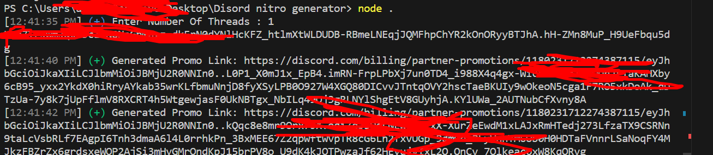

# Discord nitro generator using operaGX
  <br>
 <a href="https://github.com/alimawla69/Discord-OperaGX-Generator/"></a>
  <a href="https://github.com/alimawla69/Discord-OperaGX-Generator/stargazers"></a>
  <a href="https://github.com/alimawla69/Discord-OperaGX-Generator"></a>
 
A simple tool to generate a discord nitro generator using axios and proxies u can generate as much u want this tool only works from December 16th, 2023 (3PM PST) to June 17th, 2024 (11:59PM PST).

* It's for education, I won't be responsible for any action you take with this script.
* Don't forget to give the project a star!
* Loved the tool? Please consider [Donate 💸](https://www.patreon.com/alimawla69) to help it improve!
## FEATURES:
- Proxy support
- simple logger
- auto generate using proxies or without
- Simple to use just run put proxies and run `install.bat` then `start.bat`

# REQUIREMENTS
- A good internet to run code faster
- Premium proxies to disable discord blocking system

### Setup
* Clone this repository to your computer or download using this command.
```
git clone https://github.com/alimawla69/Discord-OperaGX-Generator.git 
```
* Paste fresh proxies into `proxies.txt`.
* Open up `install.bat` or a command prompt in the downloaded folder and type `npm install` to install the requirements.
* Start the daily runner by opening `start.bat` or typing `node app.js`, or opening up the executable you downloaded !

## Problems, Bugs and Suggestions

in case you saw any Problems, Bugs or having a Suggestions you can  tell me in the [issues](https://github.com/alimawla69/Discord-OperaGX-Generator/issues/new) OR [Discord Server](https://discord.gg/rr-dev)

and i will fix and your suggetions and tell you in news channel in [Discord Server](https://discord.gg/rr-dev)

# Contact
- [Discord Server](https://discord.gg/rr-dev)
- [business.alimawla69@gmail.com](mailto:business.alimawla69@gmail.com)
